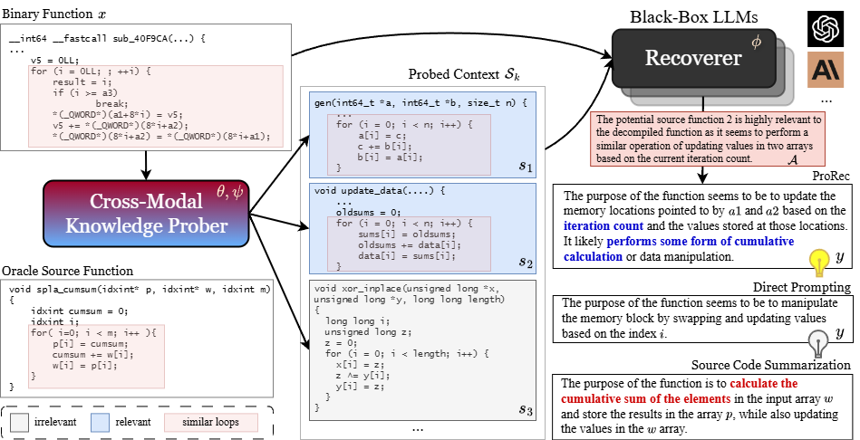

# Source Code Foundation Models are Transferable Binary Analysis Knowledge Bases

This repo contains the implementation of the paper [*Source Code Foundation Models are Transferable Binary Analysis Knowledge Bases*](https://arxiv.org/abs/2405.19581).


> For minimal reproduction, please refer to `src/binsum.ipynb` for binary summarization and `src/bfname.ipynb` for binary function name recovery. For these notebooks, we pre-computed the contexts from retriever and ProRec and included them in the datasets, so no GPU is needed to run these experiments.

---

Human-Oriented Binary Reverse Engineering (HOBRE) lies at the intersection of binary and source code, aiming to lift binary code to human-readable content relevant to source code, thereby bridging the binary-source semantic gap. Recent advancements in uni-modal code model pre-training, particularly in generative Source Code Foundation Models (SCFMs) and binary understanding models, have laid the groundwork for transfer learning applicable to HOBRE. However, existing approaches for HOBRE rely heavily on uni-modal models like SCFMs for supervised fine-tuning or general LLMs for prompting, resulting in sub-optimal performance. Inspired by recent progress in large multi-modal models, we propose to harness the strengths of uni-modal code models from both sides to bridge the semantic gap effectively. In this paper, we introduce a novel **probe-and-recover framework (ProRec)** that:
1. incorporates a binary-source encoder-decoder model and black-box LLMs for binary analysis. 
2. leverages the pre-trained knowledge within SCFMs to synthesize relevant, symbol-rich code fragments as context. This additional context enables black-box LLMs to enhance HOBRE accuracy.



## Environment Setup

```bash
conda env create --file environment.yml
```

Note that some pip-installed libraries might not be successfully installed, in which case you can further check the `environment.yml` and install them with pip.


## Datasets

Our datasets are hosted on Hugging Face and will be downloaded automatically in the notebooks.

## Models

The models (checkpoints) are also hosted on Hugging Face and will be downloaded automatically when running inference scripts.

## Important Scripts

We provide representive scripts for training and inference. We assume 4 NVIDIA A100-80G for training and inference.

> NOTE: Modify the `token` and `hub_model_id` within the yaml configs to properly upload datasets checkpoints to Hugging Face.

### Contrastive assembly-source encoder pre-alignment

```bash
torchrun --nproc_per_node=4 run_casp.py scripts/configs/train_casp_moco.yaml
```


### Binary-source encoder-decoder alignment

```bash
torchrun --nproc_per_node=4 run_prober.py scripts/configs/train_prober.yaml
```

### Probing Function Signature

```bash
accelerate launch --num_processes=4 big_model_quantized_probing.py scripts/configs/probe_quantized_codellama-34b-4bit-unfreeze.yaml
```

### Score and Filter Probed Signatures

```bash
python score_and_filter_signature.py scripts/configs/filter_sig.yaml
```

## Citation

```
@misc{su2024sourcecodefoundationmodels,
      title={Source Code Foundation Models are Transferable Binary Analysis Knowledge Bases}, 
      author={Zian Su and Xiangzhe Xu and Ziyang Huang and Kaiyuan Zhang and Xiangyu Zhang},
      year={2024},
      eprint={2405.19581},
      archivePrefix={arXiv},
      primaryClass={cs.SE},
      url={https://arxiv.org/abs/2405.19581}, 
}
```